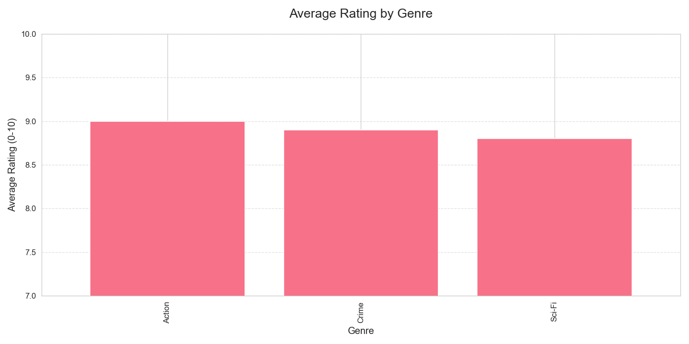

# 🎬 BingeBook - Advanced Movie Analytics Dashboard


**BingeBook** transforms your movie viewing data into actionable insights through beautiful, professional visualizations powered by Python's data science stack.

## 🌟 Key Features

- **Triple Visualization Engine**:
  - 📊 Genre performance benchmarking
  - 📈 Rating vs runtime correlation analysis
  - 🆚 Streaming platform comparisons
- **Smart Data Handling**:
  - Automatic sample data generation
  - CSV integration for personal datasets
  - Error-resistant architecture
- **Professional Styling**:
  - Publication-quality charts
  - Responsive layouts
  - Custom color palettes
- **Actionable Insights**:
  - Identify highest-rated genres
  - Spot rating-length relationships
  - Compare streaming services

## 🚀 Quick Start

### Prerequisites
- Python 3.8+
- Pip package manager

### Installation
```bash
git clone https://github.com/Kirankumarvel/BingeBook.git
cd BingeBook
pip install -r requirements.txt
```

### Basic Usage
1. Add your movie data to `data/movie_ratings.csv` (sample format below)
2. Run the analyzer:
   ```bash
   python movie_analysis.py
   ```
3. Find visualizations in the `assets/` folder

## 📂 Data Format
```csv
title,genre,rating,watch_time_min,platform,year
The Godfather,Crime,9.2,175,HBO,1972
Parasite,Thriller,8.5,132,Hulu,2019
```

## 🎨 Visualization Gallery

### 1. Genre Ratings Analysis

- Bar chart comparing average ratings by genre
- Sorted by highest-rated genres
- Customizable color schemes

### 2. Rating vs Runtime

- Scatter plot with multiple dimensions:
  - X-axis: Movie length (minutes)
  - Y-axis: IMDB-style rating
  - Color: Genre
  - Size: Release year
- Reveals trends in movie length preferences

### 3. Platform Comparison

- Dual-panel comparison:
  - Average ratings by service
  - Content distribution pie chart
- Identify which platforms have the best content

## 🛠️ Customization Guide

### Data Options
1. **Personal Data**: Replace `data/movie_ratings.csv`
2. **API Integration** (example):
   ```python
   # Add to movie_analysis.py:
   # df = pd.read_json('https://movie-api.example.com/your-data')
   ```

### Style Modifications
```python
# Change visualization style:
plt.style.use('ggplot')  # Alternatives: 'seaborn', 'fivethirtyeight'

# Modify color palette:
sns.set_palette("rocket")  # Try: "mako", "flare", "crest"
```

### Technical Adjustments
- Change moving average window:
  ```python
  df['Rolling_rating'] = df['rating'].rolling(5).mean()  # 5-movie avg
  ```
- Add new visualizations by extending `create_visualizations()`

## 💡 Pro Tips

1. **Enhance with TMDB Data**:
   ```python
   # pip install tmdbv3api
   # from tmdbv3api import TMDb
   ```

2. **Create Interactive Version**:
   ```python
   # pip install plotly
   # import plotly.express as px
   ```

3. **Automate Data Collection**:
   - Set up Letterboxd export integration
   - Use IMDB/Plex APIs

## 🐛 Troubleshooting

| Issue | Solution |
|-------|----------|
| Missing data file | Let script generate sample data or create CSV |
| Visualization errors | Check for NaN values in data |
| Style not applying | Verify seaborn/matplotlib versions |
| Font warnings | Install missing system fonts |

## 🤝 Contributing

We welcome:
- New visualization types (heatmaps, radar charts)
- Machine learning integrations
- Streaming service API connectors
- Improved UI/UX

**Contribution Guide**:
1. Fork the repository
2. Create your feature branch
3. Submit a pull request

## 📜 License

MIT License - Free for personal and commercial use

---

**Film Buff Tip**: Combine with [Letterboxd](https://letterboxd.com/) data exports for automatic personal movie analytics! 🍿
